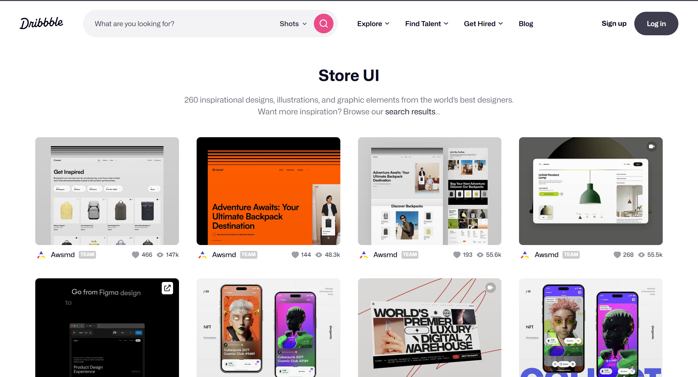

## **Design reference Websites for inspirations.**

1. **[AWWWARDS](https://www.awwwards.com/)** – Showcases award-winning websites, offering inspiration and best practices for UI design and development.

2. **[DRIBBBLE](https://dribbble.com/)** – A community of designers sharing screenshots of their work, ideal for finding inspiration and connecting with other creatives.

3. **[MOBBIN](https://mobbin.com/)** – A comprehensive library of hand-picked mobile and web design patterns from real apps, useful for UI/UX inspiration and reference.

4. **[Pinterest](https://www.pinterest.com/)** – A visual discovery platform where users can explore and save creative ideas, making it a valuable resource for design inspiration across various styles and disciplines.

## **UI Libraries**

1. **[Aceternity UI](https://ui.aceternity.com)** – A modern React component library offering customizable UI elements for fast and elegant web development.

2. **[shadcn/ui](https://ui.shadcn.com/)** – A popular React UI library providing accessible, customizable components built with Radix UI and Tailwind CSS.

There are many more ways to find inspiration for your websites , and more websites which gives good ui components, These are pretty good so check these out! Happy Coding

