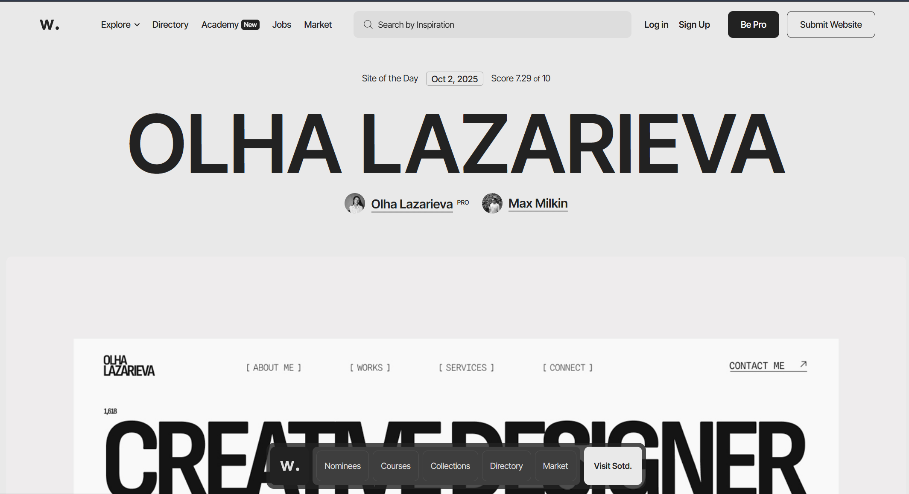
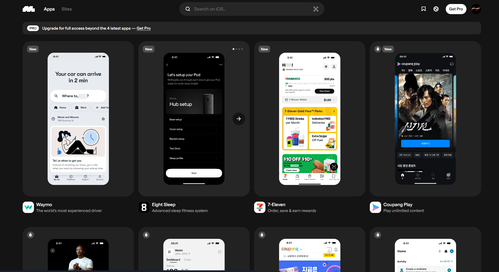
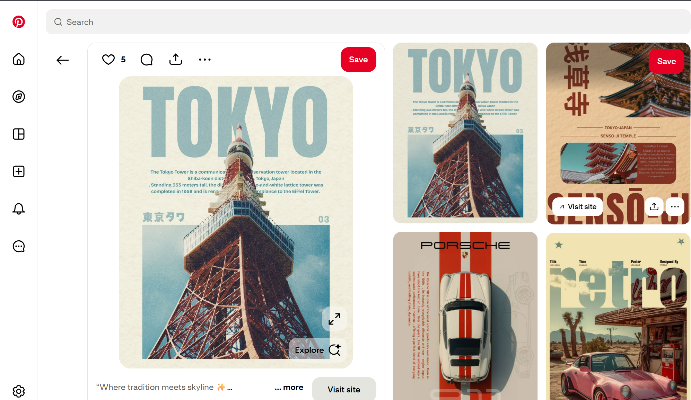
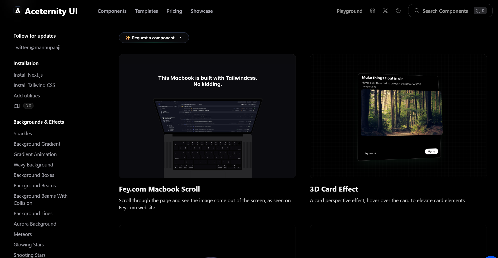
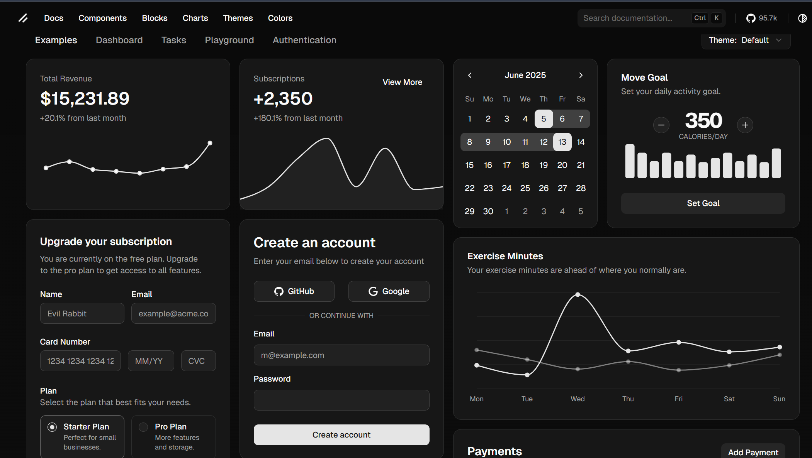

&nbsp;

# Design Reference Websites for Inspirations

&nbsp;

### 1. <a href="https://www.awwwards.com/">AWWWARDS</a>

Showcases award-winning websites, offering inspiration and best practices for UI design and development.

&nbsp;

&nbsp;

---

&nbsp;

### 2. <a href="https://dribbble.com/">DRIBBBLE</a>

A community of designers sharing screenshots of their work, ideal for finding inspiration and connecting with other creatives.

&nbsp;

&nbsp;

---

&nbsp;

### 3. <a href="https://mobbin.com/">MOBBIN</a>

A comprehensive library of hand-picked mobile and web design patterns from real apps, useful for UI/UX inspiration and reference.

&nbsp;

&nbsp;

---

&nbsp;

### 4. <a href="https://www.pinterest.com/">Pinterest</a>

A visual discovery platform where users can explore and save creative ideas, making it a valuable resource for design inspiration across various styles and disciplines.

&nbsp;

&nbsp;

---

&nbsp;

# UI Libraries

&nbsp;

### 1. <a href="https://ui.aceternity.com">Aceternity UI</a>

A modern React component library offering customizable UI elements for fast and elegant web development. 

&nbsp;

&nbsp;

---

&nbsp;

### 2. <a href="https://ui.shadcn.com/">shadcn/ui</a>

A popular React UI library providing accessible, customizable components built with Radix UI and Tailwind CSS.

&nbsp;

&nbsp;

---

&nbsp;

## Explore More!

&nbsp;

There are countless ways to find inspiration for your websites and discover great UI component libraries. These resources are a fantastic starting point—explore them and elevate your design skills. <strong>Happy Coding!</strong>

&nbsp;
